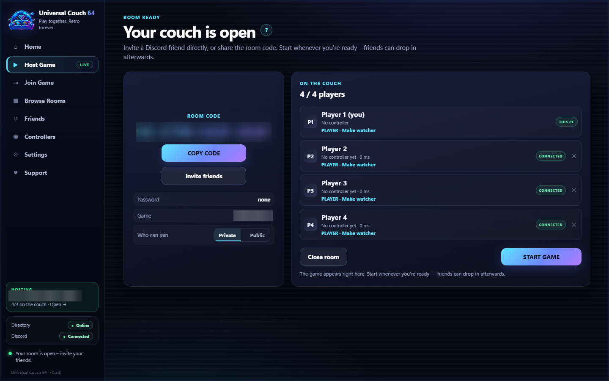
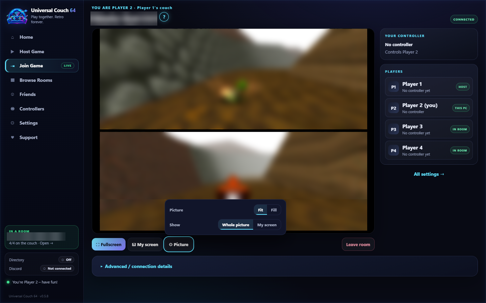
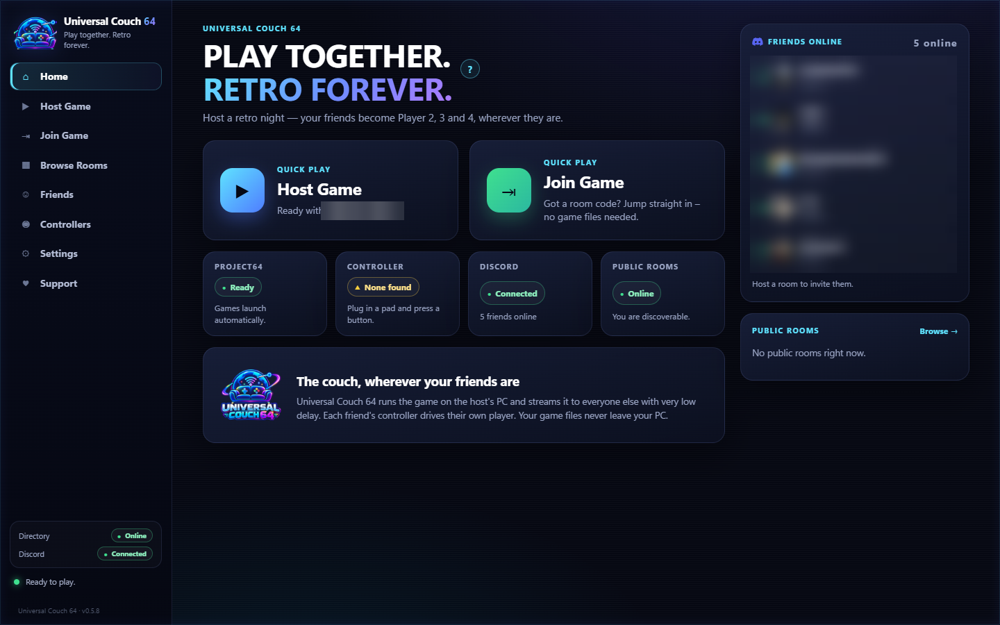

<p align="center">
  
</p>

<h1 align="center">Universal Couch</h1>

<p align="center"><b>Remote couch co-op, without making your friend build the couch.</b></p>

<p align="center">
Host an N64 game on your Windows PC with Project64. Your friends join from their own PCs,<br>
and their controllers become Player 2, 3 and 4 on your game.
</p>

## Download

### **[⬇ Download Universal Couch for Windows](https://github.com/SzebaHUN/universal-couch/releases/tag/v0.5.8)**

Under **Assets**, download **`Universal Couch_0.5.8_x64-setup.exe`**, run it, and follow the installer.
(Your browser saves it as `Universal.Couch_0.5.8_x64-setup.exe`. GitHub replaces the space with a dot.)

> [!NOTE]
> GitHub also lists **"Source code (zip)"** and **"Source code (tar.gz)"** on every release. Those archives contain only this page's documentation. They are **not** the app. You only need the `x64-setup.exe` installer.

Everyone who plays installs Universal Couch: the host and every friend who joins. Windows 10/11 (x64) is required.

## See It in Action

<table>
  <tr>
    <td width="50%"><br><sub>A full room: host + 3 remote players</sub></td>
    <td width="50%"><br><sub>Guest view of a split-screen game, with Fit / Fill and Whole picture / My screen</sub></td>
  </tr>
  <tr>
    <td width="50%"><br><sub>Fullscreen <b>My screen</b>: Player 2's quarter of a 4-player split fills the display</sub></td>
    <td width="50%"><br><sub>Universal Couch home screen</sub></td>
  </tr>
</table>

More screenshots: [host setup](docs/screenshots/02-host-room.png) · [room ready](docs/screenshots/03-session.png) · [controllers](docs/screenshots/04-controllers.png) · [settings](docs/screenshots/05-settings.png) · [join](docs/screenshots/06-join.png). Game images and private details are blurred.

## What Universal Couch Does

- **Host from one Windows PC.** Your game runs in Project64 on your PC, and friends join from theirs over the internet.
- **Up to 4 players.** The host is Player 1, and up to 3 friends take Player 2–4. Extra people can join as **watchers**.
- **Join with a room code.** Rooms use a code and an optional password. There's no port forwarding and no IP addresses to type.
- **Guests need no game.** Friends don't need the ROM, Project64 or your save. They see and hear the game and play with their own controller.
- **Controller-aware seats.** Each seat is a fixed controller port (P1–P4). The host decides who plays and who watches, and can remove players. Each player can remap buttons, and the mapping is saved per controller.
- **Fullscreen play.** Guests can watch fullscreen (Esc or double-click to leave).
- **Made for split-screen games.** With **My screen**, each player zooms into their own part of a split-screen game, even in fullscreen. **Whole picture** shows everything. Players can also hold **Z + START + R** for 2 seconds to switch.
- **Fit or Fill.** Choose how the picture fits your monitor: **Fit** shows all of it, **Fill** fills the screen.
- **Stream quality.** Choose **Responsive**, **Balanced** or **Sharp**, or leave it on **Auto**, which picks a setting for your PC based on its hardware video encoders.
- **Pause / Restart / Change game** without anyone leaving the room. Universal Couch offers to save first, and save states are kept per game.
- **Automatic Project64 setup.** One click downloads the official Project64 and applies tested settings for known games. Supported multiplayer games show as **UC verified** or **UC curated**.
- **Test ROM locally** to check a game and your controller before inviting anyone.
- **Reconnects automatically** if a guest's connection drops.
- **Public or private rooms.** Rooms are private by default. Public rooms appear in **Browse Rooms**.
- **Optional Discord connection** for friends, one-click invites and status.
- **8 languages:** both the app and the installer are fully available in English, Español, Português (Brasil), Français, Deutsch, Italiano, Magyar and Polski.

## What is Universal Couch?

Universal Couch (shown in the app as **Universal Couch 64**) brings the "everyone on one sofa" experience to friends who are far away.

- **The host** runs the game on their own PC, in Project64, with their own game file and their own save.
- **Friends** join the host's room from their own PCs. They see and hear the game, and their controller is plugged straight into the host's game as the next player.

Friends don't need the game, the ROM, an emulator or the host's save. Everything game-related stays on the host's PC.

## How It Works

```
 HOST PC                                               FRIEND'S PC
 ┌──────────────────────────────┐                     ┌──────────────────────────┐
 │ Project64 + your game        │   game video/audio  │ Universal Couch          │
 │        ▲                     │ ──────────────────▶ │  - sees & hears the game │
 │        │ Player 2/3/4 input  │                     │                          │
 │ Universal Couch (host)       │ ◀────────────────── │  - controller = Player 2 │
 └──────────────────────────────┘   controller input  └──────────────────────────┘
          direct, encrypted connection: no port forwarding, no IP addresses to type
```

- Rooms use a **room code** and an optional **password**. You don't need to set up IP addresses, open router ports or use tunnels.
- Video, audio and controller input go **directly between the PCs**, encrypted.
- Each person in the room has a role: **Player**, who gets a controller slot on the host's game, or **Watcher**, who watches the stream. The host decides who plays, and player roles map to fixed controller slots.

## Quick Start

1. **Everyone:** install Universal Couch from the [release page](https://github.com/SzebaHUN/universal-couch/releases/tag/v0.5.8). Accept the Terms on first launch.
2. **Host:** open **Host Game**. Let Universal Couch set up Project64 (it downloads it from the official Project64 website), pick your game and start the room.
3. **Host:** share the **room code** (and password) with your friend, or send an invite through the app's optional Discord connection.
4. **Friend:** open **Join Game**, enter the room code and password, and plug in a controller.
5. Play. The friend's controller is the next player on the host's game.

## Host

- You need: Windows 10/11, your own legally obtained game file, and a controller if you want to play too.
- Universal Couch sets up and uses **its own copy of Project64**, downloaded from the official Project64 website. Alternatively, you can choose a Project64 installation yourself.
- **Private room** (default): only people with the code, password or your invite can join.
- **Public room**: your room appears in **Browse Rooms** for other Universal Couch players. Public joiners start as **Watchers**, and you choose who gets promoted to Player.
- Your game, ROM, saves and Project64 settings never leave your PC.

## Guest

- You need: Windows 10/11, Universal Couch, a controller, and a decent internet connection.
- You do **not** need the game, a ROM, Project64 or the host's save.
- There are three ways to join:
  - enter a **room code + password** under **Join Game**;
  - pick a room from **Browse Rooms**;
  - accept a **Discord invite**.

## Discord & Public Rooms

**Community Discord coming soon.** A Universal Couch community server for finding players, voice chat, support and release news is planned. The link will be added here when it opens.

What already works in v0.5.8:

- **Private sessions don't need Discord.** Room code + password play works without it.
- **Optional Discord connection in the app:** link your Discord account to see your Discord friends, send and accept session invites directly from Universal Couch, and show a "Universal Couch 64" status.
- **Public rooms:** the app's **Browse Rooms** list shows rooms that hosts have chosen to make public. Anyone with Universal Couch can join them as a Watcher, and the host promotes players.

## Supported Setup

Confirmed for v0.5.8:

| | |
|---|---|
| Operating system | Windows 10/11, x64 |
| Emulator | **Project64**, set up by Universal Couch or chosen by the host |
| Games | Nintendo 64 games that support local multiplayer |
| Players | Host + up to 3 friends (4 seats), plus watchers |
| App languages | English, Español, Português (Brasil), Français, Deutsch, Italiano, Magyar, Polski (all fully translated) |
| Installer languages | The same 8 languages |

Project64 is currently the only supported emulator.

## Current Status

**v0.5.8 is an early public release.** Core hosting and remote-player functionality is working, but this is still an early public release and broader hardware and network testing is ongoing.

- Universal Couch is actively developed, and things may change between releases.
- Network environments differ. A connection that works on one network may behave differently on another.
- Controller-, game- or emulator-specific bugs may remain.
- Public testing is genuinely valuable. Please report what you find.

## Known Limitations

- **Windows only**, and **Project64 / N64 only** for now.
- **Some restrictive networks may fail to connect.** Gameplay uses a direct connection between PCs, and there is currently no relay server for networks that block direct connections (for example some mobile or carrier-grade NAT connections).
- **Input lag depends on your internet connection.** Mobile connections such as 4G/5G can add noticeable delay compared with home broadband.
- **Everyone needs the same version.** Different Universal Couch versions may not be able to join each other's rooms, so keep up to date.
- The installer is **not code-signed** yet, so Windows SmartScreen may warn on first run. Click *More info*, then *Run anyway*.

## Troubleshooting

- **Friend can't connect:** check that you both run the same version. Try another network (for example a home connection instead of mobile data). Make sure the room code and password were typed exactly.
- **Controller not working:** reconnect it before joining, and check whether the host has made you a *Player* rather than a *Watcher*.
- **Laggy picture or input:** wired or 5 GHz Wi-Fi helps. Mobile data often adds delay.
- **Logs:** Universal Couch writes a log at `%LOCALAPPDATA%\UniversalCouch\Logs\uc64.log`. Paste that path into Explorer's address bar. The log stays on your PC unless you choose to share it.

## Reporting Bugs

Please [open an issue](https://github.com/SzebaHUN/universal-couch/issues/new/choose) using the **Bug report** template. Useful details:

- Windows version (host and guest)
- controller type
- Project64 version, if you chose your own copy
- the game
- whether the host and guest connected at all
- what you expected and what happened
- screenshots, and `uc64.log` if it helps

**Never post ROMs, room passwords or private invite links in an issue.**

## Support / Community

Universal Couch is free. Support is optional and helps fund development and testing.

- [More projects on GitHub](https://github.com/SzebaHUN?tab=repositories)
- [Buy Me a Coffee](https://buymeacoffee.com/szebahun)
- [Patreon](https://www.patreon.com/cw/SzebaHUN)

## Credits

- **Universal Couch** by **SzebaHUN**.
- Built with third-party open-source software and the Discord Social SDK. See [Third-Party Notices](THIRD_PARTY_NOTICES.md).
- Project64 is a separate program by the Project64 team, under its own licence. Universal Couch downloads it from the official Project64 website and does not include it.

Universal Couch is an independent project. It is not affiliated with, endorsed by or sponsored by Nintendo, Rare, Microsoft, Discord, Cloudflare, the Project64 team or any game publisher.

## Disclaimer

Universal Couch is unofficial, independent software provided **as-is**. It does **not** provide, sell, host or distribute ROMs or other copyrighted game content. You are responsible for the games and software you use with it. See the full [Disclaimer](DISCLAIMER.md).

## Legal / Privacy

- [Terms of Use](TERMS.md)
- [Privacy Policy](PRIVACY.md)
- [Disclaimer](DISCLAIMER.md)
- [Community Guidelines](COMMUNITY_GUIDELINES.md)
- [Third-Party Notices](THIRD_PARTY_NOTICES.md)
- [License](LICENSE)

Universal Couch is proprietary software that is free to use. This repository contains documentation only; the application source code is not public.
